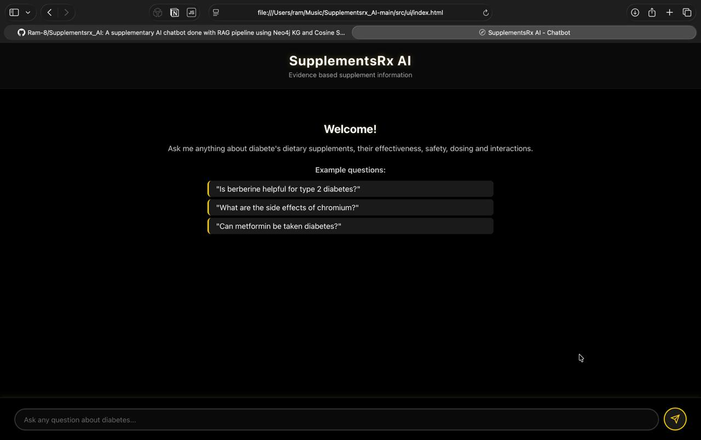
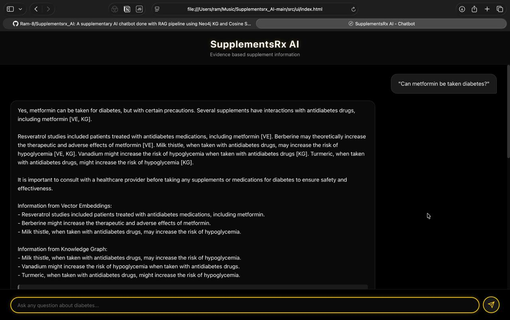
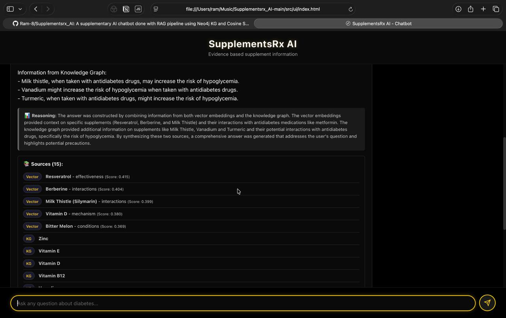
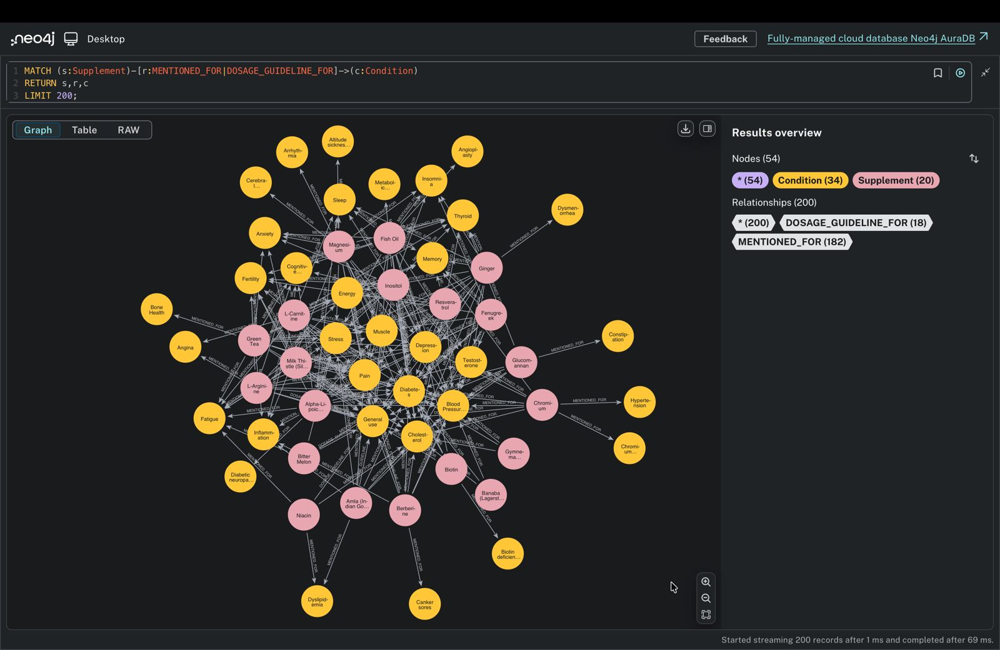

# SupplementsRx AI — Evidence-Based Supplement Guidance Agent

> **Collaborative project** — Arizona State University, CSE 573 Knowledge Representation, Fall 2025
> 
> This fork is maintained by **Ranjana Tarini Ravikumar** ([rraviku8@asu.edu](mailto:rraviku8@asu.edu)).  
> Original repository: [Ram-8/Supplementsrx_AI](https://github.com/Ram-8/Supplementsrx_AI)  
> Full team: Ram Alagappan · Sai Reshwanth Challa · Dhanush Gandham Shanthi · Abhay Jogenipalli · Ranjana Tarini Ravikumar · Rahul Tallam

---

## What This Is

SupplementsRx AI is a conversational RAG (Retrieval-Augmented Generation) system for diabetes-focused supplement guidance. It answers evidence-based questions about supplement safety, dosage, drug interactions, and effectiveness by combining:

- **Semantic vector search** — Sentence Transformer embeddings (GTE-small + PCA reduction to 256-dim) over NatMed monograph text
- **Neo4j knowledge graph** — structured relationships between supplements, conditions, and drugs (MENTIONED_FOR, DOSAGE_GUIDELINE_FOR, INTERACTS_WITH)
- **Gemini LLM synthesis** — cited answers grounded in both retrieval sources, with inline [VE] / [KG] attribution

The system achieves **nDCG@5: 0.662** and **groundedness: 0.648** on a held-out discussion-board Q&A set.

---
## Demo

| Chat Interface | Evidence-Based Answer |
|:---:|:---:|
|  |  |
| *Welcome screen with example diabetes supplement questions* | *Answer with inline [VE] and [KG] source citations* |

| Source Attribution | Knowledge Graph |
|:---:|:---:|
|  |  |
| *Vector Embeddings vs Knowledge Graph source breakdown* | *Neo4j graph — 20 supplements, 34 conditions, 200 relationships* |

---
## My Contributions

### 1. Data Preprocessing Pipeline — `src/preprocessing/structure_extractor.py`

I built the `StructureExtractor` class that converts raw scraped NatMed JSON into typed, structured fields usable by both the embedding store and the Neo4j knowledge graph.

Key components I designed and implemented:

- **`extract_drug_interactions()`** — regex-based parser that splits NatMed interaction text into structured tuples of `(drug_name, severity, interaction_type, description)`. Handles two extraction strategies: pattern-based splitting on "Interaction Rating" headers, with a fallback all-caps drug name detection pass.
- **`extract_conditions()`** — pulls health conditions from effectiveness text by scanning for NatMed effectiveness rating headers ("Likely Effective", "Possibly Effective") and a curated list of common supplement use cases.
- **`extract_dosages()`** — identifies dosage amounts (e.g. "500 mg", "1-2 grams") and frequency signals from dosing text; returns structured guideline dicts.
- **`extract_safety_ratings()`** — extracts general, pregnancy, breastfeeding, and pediatric safety ratings from NatMed safety sections; detects warning sentences using keyword filtering.
- **`process_supplement()`** — orchestrates the full pipeline per supplement, preserving original text fields for embeddings while adding structured fields for the graph.

This dual representation (text + structured fields from the same source) is what lets the system query both retrieval lanes from one data pass.

### 2. Evaluation Framework — `tests/metrics.py`, `tests/evaluate.py`, `tests/test_queries.json`

I designed and implemented the full evaluation system, including metric definitions, test queries, and the evaluation runner.

**`DiabetesRelevanceEvaluator`** — measures domain relevance using macro-averaged F1:
- Extracts diabetes keywords and supplement names from both the answer and sources
- Computes precision, recall, F1 separately for keywords and supplements
- Macro-averages across both categories
- Falls back to question-derived ground truth when manual annotations are absent

**`NDCGEvaluator`** — measures retrieval ranking quality:
- Implements DCG and IDCG calculation with logarithmic discounting
- Normalizes to nDCG@k (default k=5)
- Handles edge cases: zero scores, missing ground truth, binary relevance fallback

**`GroundednessEvaluator`** — measures answer faithfulness to retrieved sources:
- Citation presence (30%) — detects [VE] and [KG] inline citations
- Source coverage (50%) — checks how much of the retrieved content appears in the answer
- Anti-hallucination (20%) — flags dosage/number claims in the answer not present in sources
- Final score: `0.3 × citation + 0.5 × coverage + 0.2 × anti_hallucination`

**`RAGEvaluator`** — combines all three, runs batch evaluation, and aggregates mean/std/min/max statistics.

**`tests/test_queries.json`** — I curated the 10 evaluation queries with ground truth keyword lists, expected supplements, and relevance scores, covering: effectiveness questions, dosage questions, drug interaction questions, safety questions, and list-style queries.

**Evaluation runner (`tests/evaluate.py`)** — CLI script that loads test queries, initializes the pipeline, runs batch evaluation, prints per-query and aggregate results, and optionally saves to JSON.

### 3. Architecture Diagrams and Presentation Assets

I created the end-to-end architecture diagrams, knowledge graph loading/querying flow, RAG pipeline flow, vector embeddings flow, API/frontend integration diagram, and project timeline — all used in the course demo and final report.

---

## System Architecture

```
NatMed Database
      ↓
Web Scraper (Playwright + BS4)
      ↓
Raw JSON files
      ↓
Structure Extractor  ←── my contribution
      ↓
Processed JSON
     / \
    /   \
Embedding   Neo4j
 Store      Graph DB
    \      /
     \    /
   Semantic + KG Query
          ↓
     LLM (Gemini)
          ↓
   Answer with [VE]/[KG] citations
```

---

## Evaluation Results

| Metric | Pilot (10 q) | Final (5 q held-out) |
|--------|-------------|----------------------|
| Diabetes Relevance F1 (Macro) | 0.404 ± 0.195 | 0.421 ± 0.137 |
| nDCG@5 | 0.629 ± 0.132 | 0.662 ± 0.089 |
| Groundedness | 0.637 ± 0.105 | 0.648 ± 0.074 |

Evaluation followed a cross-source protocol: knowledge base is NatMed-only; test set is held-out discussion-board Q&A never seen during retrieval.

---

## Team Contributions (Full Project)

| Team Member | Primary Role |
|---|---|
| Ram Alagappan | Neo4j KG integration, HTML/CSS/JS frontend, UX |
| Sai Reshwanth Challa | Unified RAG pipeline, Gemini prompt engineering |
| Dhanush Gandham Shanthi | Neo4j schema, Cypher loader, graph indexing |
| Abhay Jogenipalli | Vector embeddings, GTE-small + PCA, semantic search |
| Rahul Tallam | Web scraper, data preprocessing, structure extractor |
| **Ranjana Tarini Ravikumar** | **Structure extractor, evaluation framework, test queries, architecture diagrams, documentation** |

---

## Setup

```bash
pip install -r requirements.txt
```

Configure `.env`:
```
NEO4J_URI=bolt://localhost:7688
NEO4J_USER=neo4j
NEO4J_PASSWORD=supplements_pass
GEMINI_API_KEY=your_key_here
```

Start the API:
```bash
uvicorn src.api.unified_rag_app:app --reload
```

Open `src/ui/index.html` in your browser.

Run evaluation:
```bash
python tests/evaluate.py --test-file tests/test_queries.json --ndcg-k 5 --output tests/evaluation_results.json
```

---

## Tech Stack

- Python, FastAPI
- Sentence Transformers (GTE-small), PCA, cosine similarity
- Neo4j, Cypher
- Google Gemini API
- HTML/CSS/JavaScript (vanilla)
- Playwright, BeautifulSoup

---

## Course Context

This project was built for CSE 573 (Knowledge Representation) at Arizona State University, Fall 2025. It is not a published paper — the PDF report is a course deliverable submitted December 2025. The data source (NatMed) was accessed via an institutional subscription provided by the course instructor.
